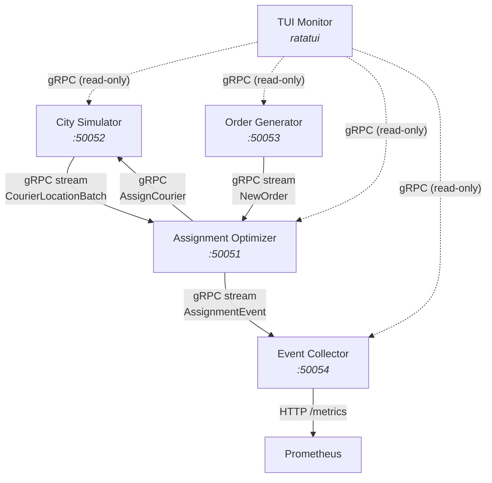

# router-flow

A distributed logistics simulator built in Rust. Four independent microservices communicate via gRPC to simulate a courier delivery system, with a terminal-based live dashboard for monitoring.

## Architecture



## Services

| Service | Port | Role |
|---------|------|------|
| **City Simulator** | 50052 (gRPC) | Simulates 25 couriers moving around Berlin, streams batched location updates |
| **Order Generator** | 50053 (gRPC) | Generates delivery orders with configurable patterns (uniform / hotspot) |
| **Assignment Optimizer** | 50051 (gRPC) | Receives locations + orders, runs weighted scoring algorithm, assigns couriers |
| **Event Collector** | 50054 (gRPC) + 3001 (HTTP) | Aggregates metrics (latency, utilization), exposes Prometheus `/metrics` endpoint |
| **TUI Monitor** | -- | Ratatui terminal dashboard with live stats and color-coded event log |

## Prerequisites

- Rust toolchain (1.85+ for edition 2024)
- `protoc` (Protocol Buffers compiler) — required by `tonic-build`

```
# macOS
brew install protobuf

# Ubuntu/Debian
sudo apt install protobuf-compiler
```

## Build

```
cargo build --workspace
```

## Run

Open **5 separate terminals**. Start services in this order — the optimizer needs city-sim and order-gen streams, and the collector needs the optimizer stream. All services have reconnection logic so exact timing doesn't matter, but this order gives the cleanest startup.

### Terminal 1 — City Simulator

```
cargo run -p city-simulator
```

Simulates 25 couriers doing random walks around Berlin (52.52N, 13.405E). Streams `CourierLocationBatch` every 500ms. Accepts `AssignCourier` RPCs to redirect couriers to pickups/dropoffs.

### Terminal 2 — Order Generator

```
cargo run -p order-generator
```

Generates delivery orders at ~2/sec using hotspot pattern (5 Berlin landmarks). Each order has a priority (50% normal, 20% low, 20% high, 10% urgent).

### Terminal 3 — Assignment Optimizer

```
cargo run -p assignment-optimizer
```

Connects to city-sim and order-gen streams. Every second, scores all idle couriers against pending orders using a weighted algorithm (distance 40%, load 30%, rating 20%, priority 10%) and assigns the best match. Notifies city-sim to redirect the courier.

### Terminal 4 — Event Collector

```
cargo run -p event-collector
```

Subscribes to the optimizer's assignment stream. Aggregates metrics in a 60-second sliding window (total assignments, avg/p95/p99 latency, courier utilization). Serves Prometheus metrics at `http://localhost:3001/metrics`.

### Terminal 5 — TUI Monitor

```
cargo run -p tui-monitor
```

Connects to all 4 services via gRPC. Shows a 4-panel dashboard with live stats and a unified color-coded event log.

**Keyboard controls:**

| Key | Action |
|-----|--------|
| `q` | Quit |
| `Tab` | Cycle focus between panels |
| `Up` / `Down` | Scroll event log (when paused) |
| `p` | Pause / resume auto-scroll |

**TUI layout:**

```
┌─ City Simulator ──────────┬─ Assignment Optimizer ──────────────┐
│ Couriers: 25 active       │ Assignments: 47                     │
│ Idle: 12  En-route: 13    │ Last score: 0.87                    │
│                            │ order=a1b2c3d4 -> courier=e5f6g7h8  │
├─ Order Generator ─────────┼─ Event Collector ───────────────────┤
│ Orders seen: 94           │ Assignments: 47  Events: 47         │
│                            │ Avg latency: 1420.3ms  p95: 2100.0ms│
│ order=a1b2c3d4 urgent     │ Utilization: 52.0%  Avg score: 0.72 │
├─ Live Event Log [auto-scroll] ───────────────────────────────────┤
│ 14:23:01 [city-sim]  connected to city simulator                 │
│ 14:23:01 [order-gen] created order=a1b2c3d4 priority=urgent      │
│ 14:23:02 [optimizer] assigned order=a1b2c3d4 -> courier=e5f6 ... │
│ 14:23:02 [collector] assigned order=a1b2c3d4 to courier=e5f6 ... │
└──────────────────────────────────────────────────────────────────┘
 q quit  Tab focus  ^/v scroll  p pause    Focus: Log
```

**Color coding:**

- `[city-sim]` — blue
- `[order-gen]` — green
- `[optimizer]` — yellow
- `[collector]` — magenta
- `[system]` — gray

## Configuration

All services read environment variables (with sensible defaults). Set them before `cargo run` or use a `.env` file.

### City Simulator

| Variable | Default | Description |
|----------|---------|-------------|
| `NUM_COURIERS` | 25 | Number of simulated couriers |
| `CITY_CENTER_LAT` | 52.52 | City center latitude (Berlin) |
| `CITY_CENTER_LNG` | 13.405 | City center longitude |
| `CITY_RADIUS_KM` | 5.0 | Radius of the city area |
| `TICK_INTERVAL_MS` | 500 | Simulation tick interval |
| `MOVEMENT_SPEED` | 0.001 | Movement per tick (degrees) |
| `GRPC_PORT` | 50052 | gRPC server port |

### Order Generator

| Variable | Default | Description |
|----------|---------|-------------|
| `ORDER_RATE_PER_SEC` | 2.0 | Orders generated per second |
| `GENERATION_PATTERN` | hotspot | `uniform` or `hotspot` |
| `GRPC_PORT` | 50053 | gRPC server port |

### Assignment Optimizer

| Variable | Default | Description |
|----------|---------|-------------|
| `GRPC_PORT` | 50051 | gRPC server port |
| `CITY_SIMULATOR_ADDR` | http://localhost:50052 | City Simulator address |
| `ORDER_GENERATOR_ADDR` | http://localhost:50053 | Order Generator address |
| `WEIGHT_DISTANCE` | 0.40 | Distance scoring weight |
| `WEIGHT_LOAD` | 0.30 | Load scoring weight |
| `WEIGHT_RATING` | 0.20 | Rating scoring weight |
| `WEIGHT_PRIORITY` | 0.10 | Priority scoring weight |
| `ASSIGNMENT_INTERVAL_MS` | 1000 | Assignment engine tick interval |

### Event Collector

| Variable | Default | Description |
|----------|---------|-------------|
| `GRPC_PORT` | 50054 | gRPC server port |
| `HTTP_PORT` | 3001 | Prometheus metrics HTTP port |
| `OPTIMIZER_ADDR` | http://localhost:50051 | Optimizer address |
| `WINDOW_SIZE_SECS` | 60 | Sliding window for metrics |

### TUI Monitor

| Variable | Default | Description |
|----------|---------|-------------|
| `CITY_SIMULATOR_ADDR` | http://localhost:50052 | City Simulator address |
| `ORDER_GENERATOR_ADDR` | http://localhost:50053 | Order Generator address |
| `OPTIMIZER_ADDR` | http://localhost:50051 | Optimizer address |
| `COLLECTOR_ADDR` | http://localhost:50054 | Event Collector address |

## Tests

```
cargo test --workspace
```

24 tests across the workspace:

| Crate | Tests | What |
|-------|-------|------|
| `router-flow-shared` | 5 | Scoring algorithm, haversine distance |
| `city-simulator` | 6 | Courier movement, waypoint arrival, state transitions |
| `order-generator` | 5 | Order generation patterns, priority distribution |
| `event-collector` | 8 | Aggregation math, percentiles, Prometheus format |

## Project Structure

```
router-flow/
├── Cargo.toml                          # Workspace manifest
├── proto/                              # Shared protobuf definitions
│   ├── build.rs
│   └── src/
│       ├── lib.rs                      # Re-exports: location, order, assignment, collector
│       ├── location.proto              # StreamLocations (batch), AssignCourier
│       ├── order.proto                 # StreamOrders
│       ├── assignment.proto            # WatchAssignments
│       └── collector.proto             # GetMetrics, WatchCollectorEvents
├── crates/
│   └── shared/                         # Core logic ported from dispatch-router
│       └── src/
│           ├── engine/scoring.rs       # Weighted scoring algorithm
│           ├── geo/mod.rs              # Haversine distance
│           └── models/                 # Courier, Order, Assignment, GeoPoint
└── services/
    ├── city-simulator/                 # Phase 1
    │   └── src/
    │       ├── main.rs                 # Startup, gRPC server
    │       ├── config.rs               # Service configuration
    │       ├── courier.rs              # SimCourier, MovementState
    │       ├── movement.rs             # Step logic, waypoint transitions
    │       ├── grpc.rs                 # LocationService (StreamLocations, AssignCourier)
    │       └── simulation.rs           # Tick loop
    ├── order-generator/                # Phase 2
    │   └── src/
    │       ├── main.rs
    │       ├── config.rs
    │       ├── patterns.rs             # Uniform + hotspot generation, priority distribution
    │       ├── grpc.rs                 # OrderService (StreamOrders)
    │       └── generator.rs            # Generation loop
    ├── assignment-optimizer/           # Phase 3
    │   └── src/
    │       ├── main.rs
    │       ├── config.rs
    │       ├── state.rs                # CourierSnapshot, PendingOrder, AppState
    │       ├── grpc_clients.rs         # Location + order stream consumers
    │       ├── engine.rs               # Batch assignment loop with scoring
    │       └── grpc_server.rs          # AssignmentService (WatchAssignments)
    ├── event-collector/                # Phase 4
    │   └── src/
    │       ├── main.rs
    │       ├── config.rs
    │       ├── state.rs                # CollectorState, broadcast channel
    │       ├── aggregator.rs           # Sliding-window metrics
    │       ├── grpc_client.rs          # Assignment stream consumer
    │       ├── grpc_server.rs          # CollectorService (GetMetrics, WatchCollectorEvents)
    │       └── metrics.rs              # Prometheus /metrics HTTP endpoint
    └── tui-monitor/                    # Phase 5
        └── src/
            ├── main.rs                 # Terminal setup, event loop
            ├── config.rs               # Service addresses
            ├── state.rs                # TuiState, LogEntry, panel stats
            ├── streams.rs              # 5 async gRPC consumers -> mpsc channel
            └── ui.rs                   # Ratatui layout and rendering

```

## Ported from dispatch-router

The core scoring algorithm and data models are ported from [dispatch-router](https://github.com/meowyx/dispatch-router), a standalone delivery order-to-courier assignment service. These live in `crates/shared/`:

| Module | What | Changes |
|--------|------|---------|
| `engine/scoring.rs` | Weighted scoring (distance 40%, load 30%, rating 20%, priority 10%) | Weights made configurable via `ScoringWeights` struct |
| `geo/mod.rs` | Haversine distance calculation | Copied as-is |
| `models/` | Courier, GeoPoint, DeliveryOrder, Assignment, ScoreBreakdown | Copied as-is |

Each ported source file has attribution comments pointing to the dispatch-router origin.

## Future Improvements

- **Correlation IDs** — propagate trace IDs through gRPC metadata for end-to-end request tracing
- **Prometheus + Grafana** — scrape `/metrics` from all services, build latency/utilization dashboards
- **Jaeger distributed tracing** — OpenTelemetry instrumentation across all gRPC calls
- **Graceful shutdown** — handle SIGTERM/SIGINT in all services, drain connections cleanly
- **Run script** — `scripts/run-local.sh` to start all services with one command
