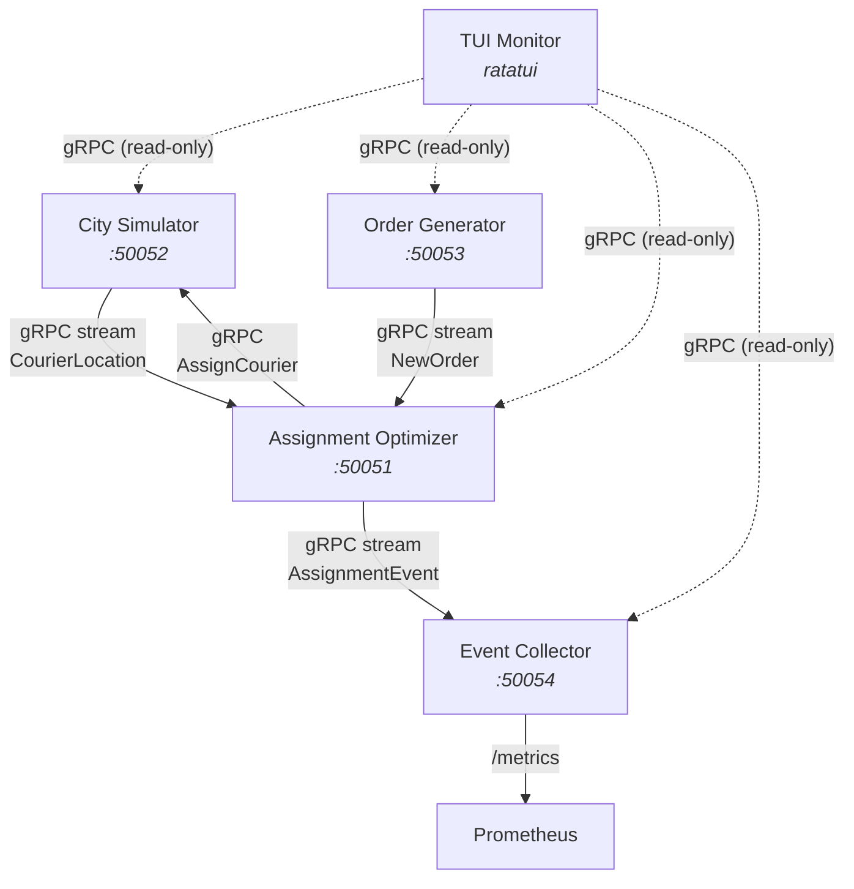

# router-flow

A distributed logistics simulator built in Rust. Four independent microservices communicate via gRPC to simulate a courier delivery system, with a terminal-based live dashboard for monitoring.

## Architecture



## Services

| Service | Port | Description |
|---------|------|-------------|
| **City Simulator** | 50052 | Simulates couriers moving around a city grid, streams location updates |
| **Order Generator** | 50053 | Generates delivery orders with configurable patterns (uniform, hotspot, time-of-day) |
| **Assignment Optimizer** | 50051 | Receives locations + orders, runs weighted scoring algorithm, assigns couriers to orders |
| **Event Collector** | 50054 | Aggregates metrics, stores event logs, exposes Prometheus endpoint |
| **TUI Monitor** | -- | Ratatui-based terminal dashboard showing live stats and color-coded event log from all services |

## Tech Stack

Rust, tonic (gRPC), tokio, ratatui, Prometheus, Grafana, OpenTelemetry/Jaeger

## Ported from dispatch-router

The core scoring algorithm and data models are ported from [dispatch-router](https://github.com/meowyx/dispatch-router), a standalone delivery order-to-courier assignment service. These live in the `crates/shared` library crate:

| Module | What | Changes |
|--------|------|---------|
| `engine/scoring.rs` | Weighted scoring algorithm (distance 40%, load 30%, rating 20%, priority 10%) | Weights made configurable via `ScoringWeights` struct |
| `geo/mod.rs` | Haversine distance calculation | Copied as-is |
| `models/courier.rs` | Courier, GeoPoint, CourierStatus | Copied as-is |
| `models/order.rs` | DeliveryOrder, Priority, OrderStatus | Copied as-is |
| `models/assignment.rs` | Assignment, ScoreBreakdown | Copied as-is |

Everything else (services, gRPC wiring, state management, metrics, TUI) will be built from scratch.

## Project Structure

```
router-flow/
├── Cargo.toml                  # Workspace
├── proto/                      # Shared protobuf definitions (location, order, assignment)
├── crates/
│   └── shared/                 # Core logic ported from dispatch-router (scoring, geo, models)
└── services/                   # Each service will be added here as built
```

## Status

Under active development.
